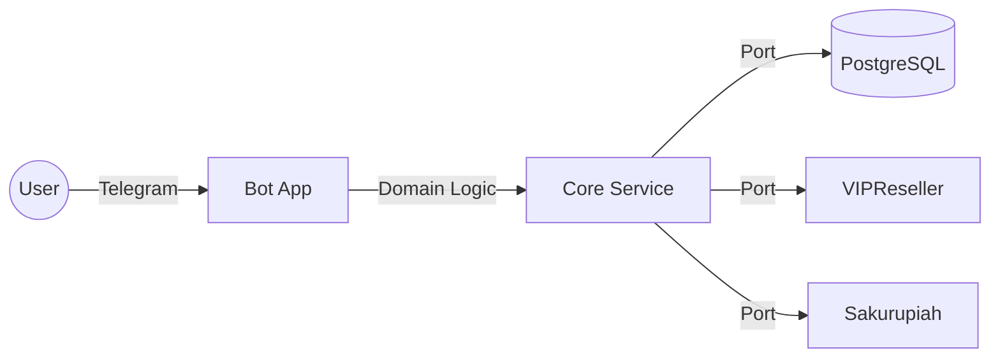

# 🤖 Bot Medsos - Telegram Game Top-Up Automation


> **Enterprise-grade Telegram Bot** for automated game top-ups, built with Hexagonal Architecture and Docker orchestration.

---

## 📋 Table of Contents

- [✨ Key Features](#-key-features)
- [🏗️ System Architecture](#-system-architecture)
- [🛠️ Tech Stack](#-tech-stack)
- [🚀 Quick Start](#-quick-start)
- [🐳 Deployment (Docker)](#-deployment-docker)
- [🧪 Testing & Development](#-testing--development)
- [📝 Configuration](#-configuration)
- [🤝 Contributing](#-contributing)

---

## ✨ Key Features

- **🛍️ Digital Product Marketplace**: Seamless integration with **VIPReseller** for games like Mobile Legends, Free Fire, and PUBG.
- **💳 Multi-Channel Payments**: Automated payments via **Sakurupiah** (QRIS, E-Wallet, VA).
- **🛡️ Secure Webhooks**: Protected via **Cloudflare Tunnel** and **Nginx Reverse Proxy**.
- **📦 Session Management**: Stateful user sessions for shopping cart and transaction flows.
- **⚡ High Performance**: Optimized connection pooling via Prisma & PostgreSQL.
- **🔍 Hexagonal Design**: Clean separation of concerns (Domain vs Infrastructure).

---

## 🏗️ System Architecture

This project adheres to **Hexagonal Architecture (Ports & Adapters)** to ensure maintainability and testability.

### High-Level Flow



### Directory Structure

```bash
bot-medsos/
├── core/                    # 🟢 Domain Layer (Business Logic ONLY)
│   ├── services/            # Pure domain logic
│   ├── entities/            # Data models
│   └── applications/        # Use cases
├── adapters/                # 🔌 Infrastructure Layer (External Comms)
│   ├── platform/            # Cloudflare, System adapters
│   ├── shared/              # Database, API clients
│   └── bot-telegram/        # Telegram interface
├── infrastructure/          # 🏗️ DevOps & Configuration
│   ├── docker/              # Docker setup
│   ├── nginx/               # Nginx setup
│   └── cloudflare-tunnel/   # Tunnel config
└── server/                  # 🚀 Application Entry Point
```

---

## 🛠️ Tech Stack

| Component | Technology | Description |
|-----------|------------|-------------|
| **Runtime** | Node.js v20 | ES Modules, Native Fetch |
| **Framework** | Express v5 | Webhook handling |
| **Database** | PostgreSQL 16 | Relational data store |
| **ORM** | Prisma 5.22 | Type-safe database client |
| **Infra** | Docker Compose | Orchestration (App, DB, Nginx, Tunnel) |
| **Gateway** | Nginx / BunkerWeb | Reverse Proxy & WAF |

---

## 🚀 Quick Start

### Prerequisites
- Node.js v20+
- PostgreSQL (or Docker)
- Telegram Bot Token

### 1. Installation

```bash
git clone https://github.com/username/bot-medsos.git
cd bot-medsos
npm install
```

### 2. Configuration

Set up your environments. We use **environment-specific** configuration files:

```bash
cp .env.example .env.development
# Edit .env.development with your local credentials
```

### 3. Run Locally (Development)

```bash
# Starts app with .env.development
npm run start:dev
```

### 4. Database Setup

```bash
# Generate Prisma Client
npm run db:generate

# Push Schema to DB
npm run db:push
```

---

## 🐳 Deployment (Docker)

We support **multi-environment** deployment using Docker Compose.

### Development Mode
*Uses standard Nginx and local `.env.development`*

```bash
# Start all services
podman-compose -f infrastructure/docker/docker-compose.yml up -d
```

### Production Mode
*Uses BunkerWeb WAF and `.env.production`*

```bash
# Start with production overrides
podman-compose -f infrastructure/docker/docker-compose.yml -f infrastructure/docker/docker-compose.production.yml up -d
```

### Services Status
```bash
podman-compose ps
```

---

## 📝 Configuration

The application automatically loads the correct environment file based on `NODE_ENV`:

| Environment | File | Usage |
|-------------|------|-------|
| **Development** | `.env.development` | Local testing, verbose logs |
| **Staging** | `.env.staging` | Testing server, sandbox APIs |
| **Production** | `.env.production` | Live traffic, optimized logs |

**Required Variables:**
- `DATABASE_URL`: Postgres connection string
- `TELEGRAM_TOKEN`: Bot API Token
- `VIPRESELLER_API_KEY`: Game Provider Key
- `SAKURUPIAH_API_KEY`: Payment Gateway Key

---

## 🤝 Contributing

1. Fork the repository
2. Create your feature branch (`git checkout -b feature/AmazingFeature`)
3. Commit your changes (`git commit -m 'feat: Add some AmazingFeature'`)
4. Push to the branch (`git push origin feature/AmazingFeature`)
5. Open a Pull Request

---

## 📄 License

Proprietary Software. Internal Use Only.
